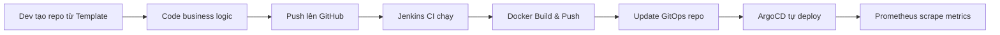

# 🛤️ Golden Path

## Golden Path là gì?

Con đường chuẩn để tạo service mới. Mọi service đi theo con đường này sẽ tự động có:

- ✅ CI/CD Pipeline
- ✅ Docker Build & Push
- ✅ ArgoCD GitOps Deploy
- ✅ Prometheus Monitoring
- ✅ Health Checks
- ✅ Argo Rollouts Canary

## Flow

## Template bao gồm

| File | Mục đích |
|------|----------|
| `Dockerfile` | Build container image |
| `Jenkinsfile` | CI/CD pipeline |
| `values.yaml` | Helm chart config |
| `README.md` | Hướng dẫn cho dev |

## Dev chỉ cần làm gì?

1. Sửa `values.yaml`: điền tên app, port
2. Code business logic trong `src/`
3. Push lên GitHub
